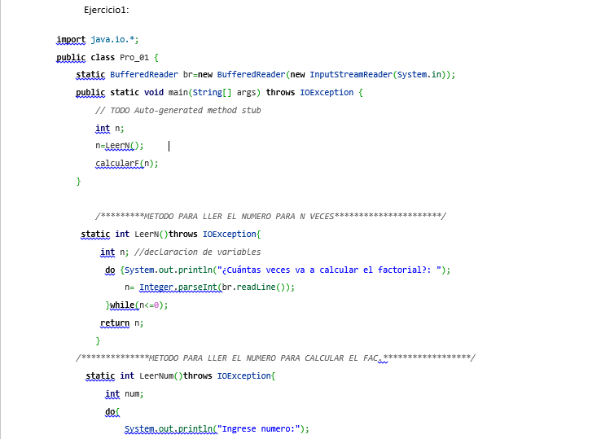
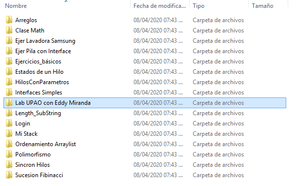
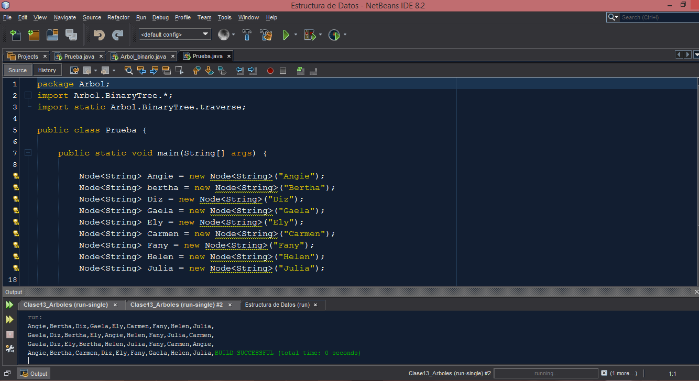
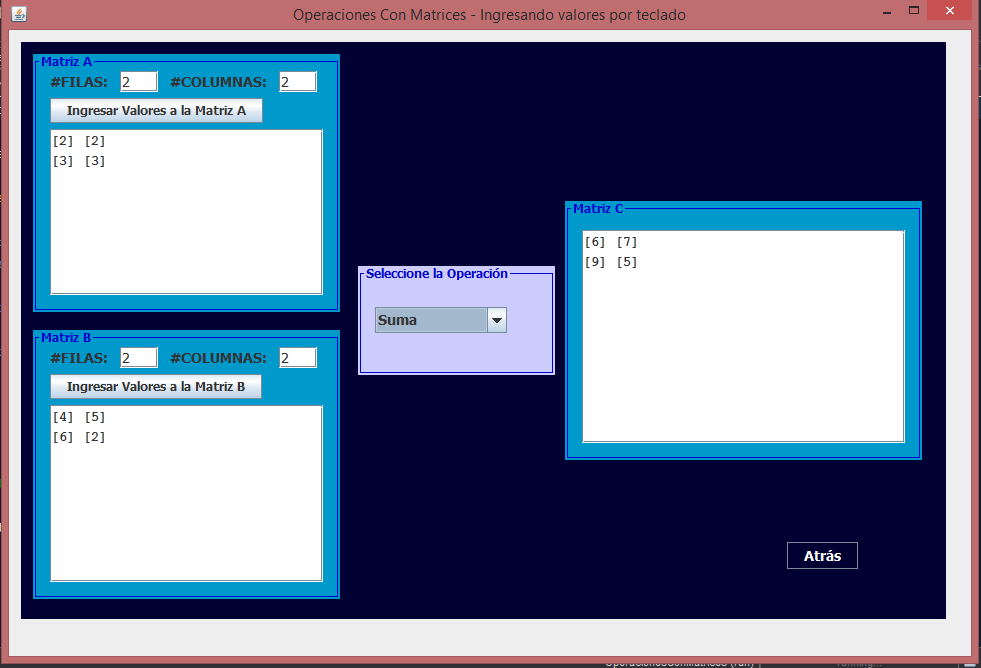

# Resolved Programming Exercises (JAVA) <h1> 
## Table of Contents: <h2>

* Programming Fundamentals l
* Object-oriented Programming
* Data structure
* Linear Algebra and Desripcitva Geometry Project (Matrices)

### What you will find: <h3> 

In * Programming Fundamentals * there is a file containing the entire ** Final Project ** of the course.

### Capture of the file with the codes: 

 

In * Object Oriented Programming * you will find several exercises solved for a better understanding. Also inside the folder is the ** OOP ** course with all the exercises solved in the Laboratory.

### Folder Capture:

 

In * Data Structure * you will find all ** solved Lab exercises. **

### Capture a solved exercise:

 

Finally you will find a small project that was left in the course of * Linear Algebra and Descriptive Geometry *, which is a small software that solves ** Matrix operations. **

### Capture the program :

 

## You will also find a JAVA Book in a folder where it explains everything in detail, you can download it.

> If this is helpful for you, don't forget to share it with others, after all I'm looking to help. Good luck and if you need help do not hesitate to write to me.

Support or visit my Ko-fi profile for more help :heart_eyes: :heart:

